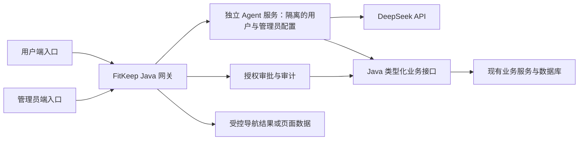

# FitKeep Agent 插件可行性与架构分析

日期：2026-09-29。范围：本地源码、现有 Agent 草稿、StudyPilot 的能力矩阵与契约；未修改业务代码，未使用真实 DeepSeek 密钥，也未执行线上 Agent 操作。

## 结论

**可以实现“由 Agent 下达 FitKeep 已定义的业务操作”。** Agent 只通过 Java 后端的登记接口查询或提交指令。Java 继续负责身份、业务规则、数据库和返回给现有页面的数据。浏览器照常渲染页面并完成跳转。模型不获得任意 API、数据库、文件系统或管理员权限。新增业务功能需要补充对应接口和工具登记，无法自动继承无限能力。

推荐开发两套逻辑上隔离的 Agent：用户端 Agent 只拥有用户业务工具；管理员端 Agent 只在管理员会话中提供管理工具，并对每一次涉及用户或平台数据的查询、修改、增加和删除要求管理员逐项授权。两套 Agent 可以共用模型适配和会话基础设施，但工具目录、权限、对话上下文和审计分别管理。管理员预先明确授权后，社区监管有一项窄例外：Agent 可以自动隐藏规则明确的不当内容，并立即送管理员事后复核；不确定内容只进入待审队列。

推荐的长期结构是：FitKeep Java 后端继续拥有业务数据、鉴权和最终写入；`agent-plugin` 作为独立进程负责模型调用、意图规划和对话；浏览器中的用户悬浮窗与管理端入口只展示结果、审批卡或 Java 返回的受控导航目标。Java 增加小型 Agent 网关与确实缺失的业务接口，不把业务规则搬入插件。插件可独立升级、关闭或回滚，主项目仍可独立运行。短期可复用现有 Java 内嵌 MVP 验证用户端能力，但它尚不符合运行时独立和管理员端隔离的目标。

其中 `A → T` 是内网调用。Java 从已认证请求取得用户身份；模型不得提供 `userId`、任意 URL、SQL、Java 类名或页面选择器。管理员工具只在当前用户确有管理员权限时开放。插件服务不直连业务数据库，不接收可复用的管理员万能令牌。Java 返回固定路由名和课程 ID 后，现有浏览器页面执行跳转与渲染；这不属于 Agent 直接操作页面或数据库。

## 当前代码事实

FitKeep 是 Spring Boot 3.2 / Java 21 应用，用户页和管理页是服务端托管的静态 HTML/JavaScript。Java 已提供课程、打卡、番茄钟、社区、文件上传和管理接口；鉴权通过 JWT，`/api/admin/**` 要求 `ADMIN` 角色。接口清单来自 `server/src/main/java/com/server/server/controller/`，权限规则来自 `config/SecurityConfig.java`。

本地未提交的 MVP 在 `server/src/main/java/com/server/server/agent/AgentController.java` 实现 `POST /api/agent/chat`。它在同一个 Java 进程内请求 DeepSeek 兼容接口，然后用当前用户的 JWT 回调本机业务 API。当前只登记三个读取工具：课程列表、今日打卡状态、番茄钟统计；唯一写工具是预览后确认打卡。`server/src/main/resources/static/user/agent-widget.js` 只在用户首页显示悬浮窗。模型密钥留在服务端。这个实现证明了基本 API 联调方式可行，但不等于全项目操作能力，更不是独立进程插件。

已知验证证据是现有 `AgentControllerTest` 对模拟模型和模拟项目 API 的测试，以及此前本机 JWT 与真实业务接口联调记录。尚无真实 DeepSeek 密钥调用、全业务工具覆盖或线上 Agent 验收。本报告没有重跑测试，也不把之前的测试写成新的运行结果。当前自动部署工作流只发布已提交的 `server/**`，这些未提交的 Agent 文件仍未上线。

## 能力覆盖与接口缺口

| 领域 | 现有接口或页面能力 | Agent 当前状态 | 达成目标所需工作 |
| --- | --- | --- | --- |
| 课程与视频 | 课程列表、详情、视频列表；管理员增删改课程和视频 | 仅课程列表可查 | 用户说“打开课程”时，Java 查询课程、校验可访问性并返回固定路由和课程 ID，由现有页面跳转；管理员查询与写入逐项审批 |
| 打卡 | 状态、个人记录、提交；管理员查询和删除 | 状态查询、确认后提交 | 增加个人记录工具；管理员工具单独隔离；确认需防重放与审计 |
| 番茄钟 | 记录、统计、保存周期 | 仅统计 | 增加记录和保存工具；开始、暂停、计时若要纳入 Agent 范围，需新增 Java 计时会话 API，否则仍由用户使用现有页面 |
| 社区 | 帖子列表、详情、发帖、点赞、评论、删除；管理员可隐藏/恢复帖子 | 尚未登记 | 增加读写工具；先修复帖子删除的归属权限、点赞约束；明确违规帖可在预授权下自动隐藏，评论需新增隐藏能力 |
| 个人资料 | 页面主要从浏览器本地存储和其他统计接口取值 | 尚未登记 | 增加 `GET/PATCH /api/me` 等受限接口；登录、注册和密码输入保持用户直接操作 |
| 文件与图片 | 通用上传、课程封面和视频上传 | 尚未登记 | 用户实际提供文件后才能上传；限制类型、大小、存储和访问策略，不能让模型编造文件或任意读取服务器路径 |
| 管理后台 | 用户、课程、视频、社区、打卡管理接口 | Agent 不可用 | 独立管理员工具集；涉及用户或平台数据的每次查询和写入均出示审批卡，管理员确认后 Java 执行；避免把敏感字段送给模型 |
| 页面呈现 | 静态多页导航、表单、视频和计时器 | 仅首页聊天 | Agent 只请求 Java 查询或生成受控导航结果；现有页面负责渲染和跳转。纯浏览器本地动作若没有 Java 接口，不纳入本期 Agent 业务范围 |

“项目内任何操作”建议定义为一份可核查的 Java 接口能力矩阵：每个用户端和管理员端业务操作标明 `可读 / 可执行 / 逐项审批 / 预授权自动隐藏 / 仅用户本人 / 暂不支持`，并关联真实 Java 接口。覆盖率以矩阵和实际业务结果计算，不能用模型能回答多少类问题替代。没有后端接口的纯浏览器动作不在本期范围。对个人用户，Agent 只能使用其已有权限；对管理员，不能因为模型会调用接口就省掉逐项审批。

## 用户端与管理员端的分工

用户端 Agent 处理当前用户的日常操作。读取已发布课程、个人打卡记录和番茄钟统计可直接执行；提交打卡、发帖、保存记录等会改变数据的操作先显示准确内容，再由用户确认。比如“打开跑步入门课”，Agent 调用 Java 的课程搜索或详情接口，Java 返回匹配课程与固定导航目标，现有页面按该目标打开课程。若名称匹配多个课程，Agent 先请用户选择。比如“我上周打了几次卡”，Java 按当前登录用户查询，Agent 只解释返回的数据。

管理员端 Agent 拥有独立入口、工具目录和会话记录。管理员提出“查看用户 123 的打卡”或“隐藏帖子 456”后，Agent 先生成说明目标、字段或影响的审批卡。管理员对**该次具体查询或写入**授权后，Java 再核对管理员当前角色、审批内容和对象状态，执行一次并记录结果。用户及平台数据的增删改查原则上都可纳入，但每项必须有真实 Java 接口；当前尚未开放的操作要先补接口。删除、封禁、课程变更和批量任务不能使用一个笼统的“以后都同意”授权。普通用户令牌不能选择管理员工具；管理员进入用户端时也只取得用户端工具。管理员审批不等于把原始个人信息无限量送给模型，查询结果需按任务最小化字段。

两套 Agent 不必复制两份模型调用代码。建议共用一个轻量运行服务，设置 `USER` 和 `ADMIN` 两个互不共享工具目录与上下文的配置，并使用不同的 Java 入口，例如 `/api/agent/user/**` 与 `/api/agent/admin/**`。这仍是两套能力和使用体验，不会让用户会话意外继承管理员权限。将来如隔离要求提高，可在不改变 Java 工具契约的情况下分进程部署。

## 社区自动监管的授权边界

用户已选择“明确不当内容仅自动隐藏，管理员事后复核”。这需要管理员先启用一份明确的监管规则，授权范围限定为可恢复的隐藏操作，不包含删除、封号或更改作者内容。Agent 对每条判断保存对象 ID、原文快照或摘要、命中的规则、模型版本、理由、时间和执行结果；隐藏后立即加入管理员复核队列。管理员可以维持隐藏或恢复显示。若模型不确定、上下文不全、规则冲突或接口失败，只标记待审，不自动修改。

现有帖子已有 `status=1` 显示、`status=0` 隐藏，管理员接口 `PUT /api/admin/post/{id}/status` 可作为底层能力，但缺专用监管审批、理由、审计、幂等与复核队列。评论的 `comments` 表映射和 `Comment` 实体目前没有状态字段，只有读取、添加和删除；在增加可恢复的隐藏/恢复接口前，评论只能进入待审队列。不能把“删除评论”冒充“自动隐藏”。自动监管也需限制扫描范围、频率与一次处理数量，避免重复处理和误伤。

## 从 StudyPilot 借鉴什么

StudyPilot 的[能力矩阵](/Users/moxiao/IdeaProjects/project/docs/agent-capability-matrix-v2.md)按页面、工具、风险和“用户必须亲自操作”的边界登记能力；[Agent 契约](/Users/moxiao/IdeaProjects/project/docs/agent-native-contract.md)将模型计划、Java 工具和待确认动作分开。其[项目记录](/Users/moxiao/Documents/学习文件/知识库相关/个人知识库/02-项目/P004-project-StudyPilot/P004-project-StudyPilot.md)也记录了重要教训：工具注册不等于真实可用，过大的工具结果可能让模型错报业务事实。FitKeep 应复用能力登记、审批和验收方法，不必复制 StudyPilot 的浏览器自动化、Runner、代码修改或完整多服务体量。

适用于 FitKeep 的简化契约可包括：

- `ToolDescriptor`：稳定名称、版本、输入结构、所属用户端或管理员端、资源范围、审批规则和响应大小上限。
- `ActionPreview`：Java 生成的目标、参数、影响、过期时间和一次性 `actionId`。模型只提出意图；管理员的敏感读取和全部写入都先审批。
- `ActionExecution`：审批后，Java 重新验证当前身份、目标状态和参数，执行一次并保存结果；重复确认返回同一结果。
- `NavigationResult`：Java 返回固定路由名和业务实体 ID，现有页面负责打开，不接受模型生成的 URL 或页面选择器。
- `ModerationDecision`：只允许规则明确且已获预授权的内容自动隐藏；记录证据并进入管理员事后复核。

多步骤任务可以由插件编排，但每一步都经过 Java 工具白名单和该步要求的审批。若前一步结果与预期不同，应停止或重新询问，不要继续猜测执行。模型收到的帖子、评论、课程文字和上传内容均是数据，不是工具指令。

## 扩大权限前要处理的源码问题

以下是静态代码审阅发现，尚未做线上攻击验证。它们是开放更多 Agent 工具前的安全门槛，也值得作为普通业务接口问题修复。

1. `CommunityController.deletePost` 调用 `deletePost(id)` 时未检查帖子归属或管理员角色；目前任意已登录用户似乎能按 ID 删除他人的帖子。`likePost` 也未用用户身份做去重或频率约束。Agent 不应绕过此问题直接复用接口。
2. `CheckInController.allCheckIns` 位于 `/api/checkin/all`，而 SecurityConfig 对它只要求登录；它返回全部用户打卡记录。应限管理员或删除公共入口。
3. `AdminController.users` 返回完整 `User` 对象；`User` 含 `password` 字段，MyBatis `findAll` 从 `users` 表读出该字段。应使用不含密码哈希的响应 DTO，Agent 更不能把完整对象传给模型。
4. `FileService.uploadFile` 从原文件名取扩展名直接写入公开的 `/uploads/**`；当前代码未见类型校验或隔离。应先限定可接收的文件类型、大小和返回内容策略，再让 Agent 发起相关流程。
5. `SecurityConfig` 允许所有来源的 CORS 模式且允许凭据；前端在 `localStorage` 保存 JWT。Agent 增加高权限入口前，应收紧跨域来源并审查前端令牌暴露风险。
6. 当前打卡确认令牌由 JWT 密钥签发，可在五分钟内重复提交；业务的“每日仅一次”限制减轻了打卡重复写入，却不足以作为通用写操作协议。新协议需要独立密钥、一次性状态、幂等键和审计。用户封禁与角色变化也不能只依赖旧 JWT 内的角色声明。

这些问题不意味着当前 Agent 已可调用上述危险接口：它的工具白名单目前没有这些能力。风险出现在扩展工具或旧业务接口被直接调用时。

## 推荐实施顺序与验收条件

1. **冻结两套范围。** 分别列出用户端与管理员端的 Java 接口能力。标明直接读取、用户确认、管理员逐项审批、社区预授权自动隐藏和暂不支持。
2. **修正业务权限。** 先处理帖子归属、全体打卡记录、管理员用户响应和上传约束，并增加接口权限测试。补齐个人资料、课程定位等确实缺失的 Java 接口。
3. **建立 Java 工具网关。** 从现有 `AgentController` 分离工具注册、身份注入、输入校验、审批执行与审计。用户端先覆盖读取和课程打开；管理员端从只读审批开始，再逐项开放写入。不能提供自由 HTTP 请求或任意 SQL 工具。
4. **独立插件服务。** 把 DeepSeek 调用、会话和规划移到 `agent-plugin` 独立进程。两个 Agent 配置共用运行代码但隔离工具与上下文。Java 的 `/api/agent/**` 仍是浏览器入口与授权边界；插件只通过内网、受信服务身份和 Java 工具接口访问业务。插件故障时主站继续可用。现有 VPS 实测为 2 vCPU、1740 MiB 内存、约 644 MiB available、无 swap；部署前测量插件峰值内存。
5. **社区监管单独交付。** 先建待审队列、审计和管理员规则开关；明确违规帖子才可自动隐藏并等待复核。评论在新增可恢复隐藏能力前只标记待审。以误判、申诉、恢复和重复扫描用例验收。
6. **逐项真实验收。** 每个工具验证权限不足、非法参数、审批范围、重复执行、实际业务结果和失败恢复。课程打开在真实用户页面检查跳转后的课程 ID；管理员敏感读取验证未经批准不会返回数据。真实 DeepSeek 调用与模型费用另做小额度验收。只有矩阵对应项全部有证据时，才称该范围“可由 Agent 操作”。

建议先交付用户端“打开课程、查询个人打卡与番茄钟、社区阅读及受控发帖”闭环；随后交付管理员逐项审批的只读与写入；最后启用窄范围的社区自动隐藏。这样先验证身份和审批协议，再扩展管理能力，而不重写主站业务服务。

## 本次分析边界

本报告只读审阅源码并读取 StudyPilot 的本地设计与历史验收记录；只通过 SSH 读取了 VPS 的 CPU、内存和磁盘概要，没有读取生产密钥、数据库内容或用户数据。没有修改、提交或部署任何应用代码。报告中的接口与风险判断以 2026-09-29 本地工作树为准；StudyPilot 契约文档包含目标设计，不代表其中每项功能已在 FitKeep 实现。
